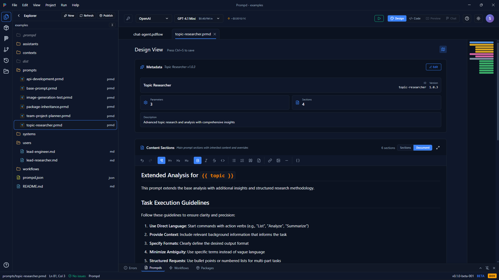
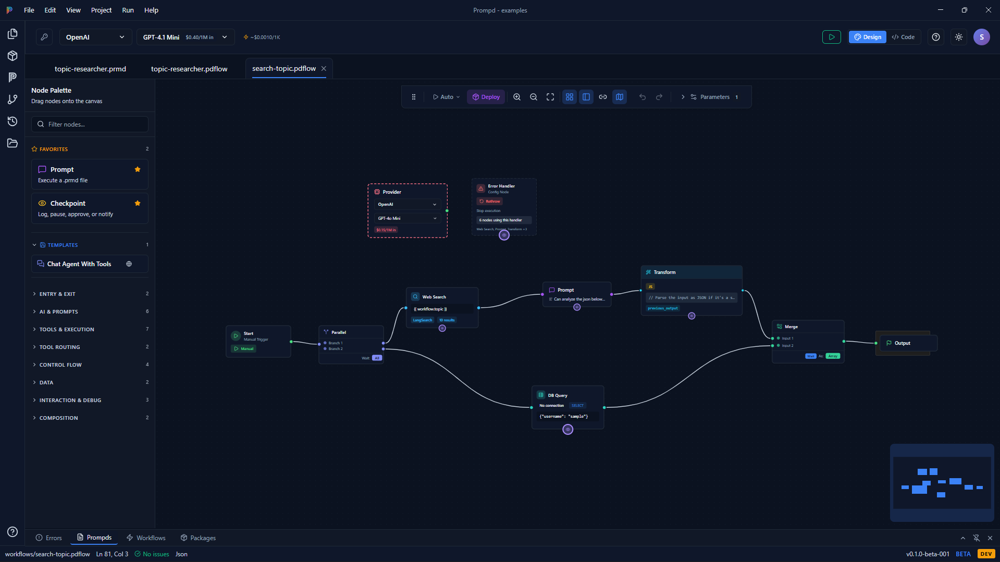
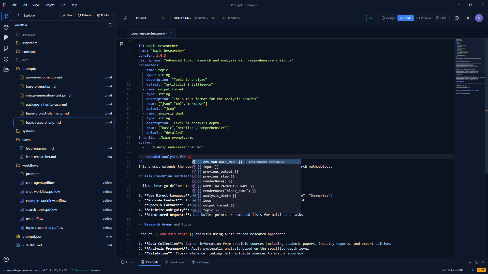
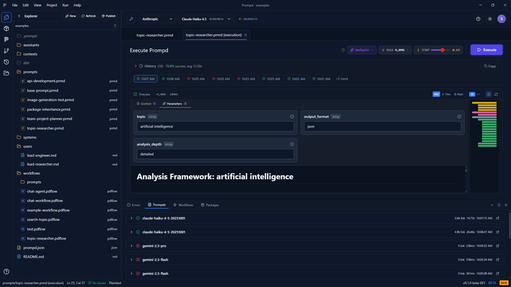
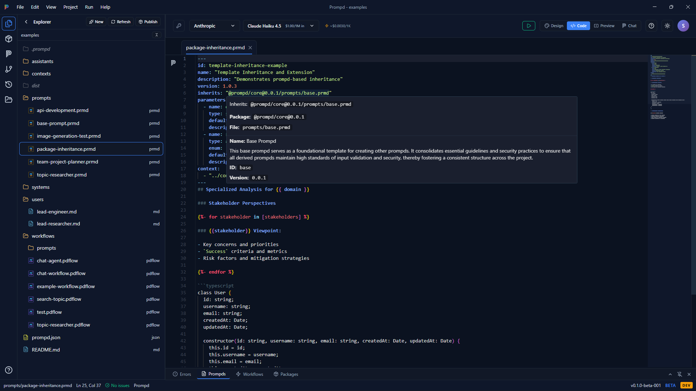

# Prompd

A local-first desktop application for creating, executing, and deploying AI workflows. Build composable prompts with visual editing, a professional code editor, and package-based inheritance.

## What is Prompd?

Prompd brings software engineering practices to AI prompt development. Instead of managing prompts as loose text files, Prompd treats them as structured, versioned, composable documents with typed parameters, inheritance, and dependency management.

**Everything runs locally.** Your API keys, prompts, and data never leave your machine. LLM calls go directly from Prompd to provider APIs with zero intermediaries.

> **Platform:** Pre-built binaries are currently **Windows only**. Mac and Linux builds are coming soon. You can build from source on any platform today.

<!-- SCREENSHOT: Design View - Open a .prmd file in Design View showing the WYSIWYG editor
     with the provider bar (Anthropic/OpenAI tabs), parameter panel, and content sections.
     Use the public-examples/prompts/topic-researcher.prmd file for a good example. -->


## Key Features

- **Visual Workflow Canvas** - Drag-and-drop editor with 27 node types: prompts, agents, parallel execution, loops, conditionals, error handling, database queries, MCP tools, and more
- **Dual Code/Design View** - Switch between a WYSIWYG design editor and Monaco code editor with IntelliSense, syntax highlighting, and package completions
- **10 LLM Providers** - OpenAI, Anthropic, Google Gemini, Groq, Mistral, Cohere, Together AI, Perplexity, DeepSeek, and local Ollama — plus any OpenAI-compatible endpoint
- **Package Inheritance** - Prompts can inherit from and extend other prompts, just like classes in software: `inherits: "@prompd/core@1.0.0/prompts/base.prmd"`
- **Execution History** - Track every run with cost tracking, success rates, timing, and full input/output history
- **MCP Integration** - Connect to Model Context Protocol servers for tool discovery and execution
- **Workflow Deployment** - Package and deploy workflows as persistent background services with cron scheduling and webhook triggers
- **Registry** - Search, install, and publish prompt packages via [PrompdHub](https://prompdhub.ai)
- **Offline Support** - Full functionality without internet after initial setup
- **Database Nodes** - Query MongoDB, PostgreSQL, MySQL, SQLite, and Redis directly from workflows

### Screenshots

<!-- SCREENSHOT: Workflow Canvas - Open a .pdflow file (e.g., search-topic.pdflow or chat-workflow.pdflow)
     showing multiple connected nodes with parallel branches. Zoom out slightly to show the full flow. -->
|  |  |
|:---:|:---:|
| **Workflow Canvas** - Visual node editor with parallel branching | **Code View** - Monaco editor with IntelliSense and YAML validation |

<!-- SCREENSHOT: Code View - Open a .prmd file in Code View showing the Monaco editor with
     YAML frontmatter syntax highlighting, IntelliSense completions visible, and the minimap. -->

<!-- SCREENSHOT: Execution View - Run a prompt and capture the execution tab showing
     the history panel with success rates, timing, cost, and the output preview. -->
|  |  |
|:---:|:---:|
| **Execution** - Run history with cost tracking and output preview | **Package Inheritance** - Versioned prompt dependencies |

<!-- SCREENSHOT: Package Inheritance - Open package-inheritance.prmd from public-examples
     showing the inherits: field and how it resolves to a base prompt. -->

## Quick Start

**Prerequisites:** Node.js 18+

```bash
# Clone the repository
git clone https://github.com/Prompd/prompd-app.git
cd prompd.app

# Build local packages (required before frontend)
cd packages/scheduler && npm install && npm run build
cd ../react && npm install && npm run build

# Launch the desktop app
cd ../../frontend && npm install
npm run electron:dev
```

The app opens with a setup wizard that walks you through configuring your first API key and creating a prompt.

## File Formats

| Extension | Description | Structure |
|-----------|-------------|-----------|
| `.prmd` | Prompt files | YAML frontmatter + Markdown body |
| `.pdflow` | Workflow definitions | YAML with visual node/edge data |
| `.pdpkg` | Package archives | ZIP bundles with manifest.json |

All file references (`inherits:`, `context:`, ``) resolve relative to the containing file's directory.

## Tech Stack

| Component | Technology |
|-----------|------------|
| Frontend | React 18 + TypeScript + Vite |
| Desktop | Electron 40 |
| State | Zustand with Immer |
| Code Editor | Monaco Editor |
| Workflow Canvas | XYFlow (React Flow) |
| Prompt Compiler | [@prompd/cli](https://www.npmjs.com/package/@prompd/cli) |
| Backend (optional) | Node.js + Express + MongoDB |

## Architecture

```
User Action -> Electron IPC -> Local Execution
                             -> Direct HTTPS to LLM APIs
                             -> @prompd/cli for compilation
                             -> SQLite for deployment state
```

The backend API is optional and only used for provider/model list updates, registry package search, and cloud sync features. All core operations (compilation, execution, file management, scheduling) run entirely in the Electron main process.

## Development

### Project Structure

```
prompd.app/
├── frontend/               # Electron + React application
│   ├── src/modules/        # Components, services, editor
│   ├── src/stores/         # Zustand state management
│   └── electron/           # Main process (IPC, services)
├── packages/
│   ├── react/              # @prompd/react - Chat UI components
│   └── scheduler/          # @prompd/scheduler - Deployment management
├── backend/                # Optional REST API
└── docs/                   # Documentation
```

### Commands

```bash
# Frontend
cd frontend
npm run dev              # Vite dev server on :5173
npm run electron:dev     # Desktop app with hot reload
npm run electron:build:win   # Windows installer (NSIS + portable)
npm run electron:build:mac   # macOS (DMG + zip)
npm run electron:build:linux # Linux (AppImage + deb)

# Backend (optional)
cd backend
npm run dev              # Development server on :3010
npm test                 # Jest tests (requires MongoDB)

# Packages
cd packages/react && npm run dev    # Watch mode
cd packages/scheduler && npm run dev # Watch mode
```

### Environment Setup

Copy the example files and configure your values:

```bash
cp frontend/.env.example frontend/.env
cp backend/.env.example backend/.env    # Only if using backend
```

At minimum, you need one LLM provider API key (e.g., Anthropic or OpenAI) configured in `~/.prompd/config.yaml` or your workspace `.env` file.

## Documentation

- [CLAUDE-ARCHITECTURE.md](CLAUDE-ARCHITECTURE.md) - Deep architecture reference (node types, state management, execution model)
- [CONTRIBUTING.md](CONTRIBUTING.md) - How to contribute
- [docs/editor.md](docs/editor.md) - Editor features and usage
- [frontend/ELECTRON.md](frontend/ELECTRON.md) - Build and distribution

## License

See [LICENSE](LICENSE) for details.
